# 🧩 Activité Pratique 1 – Injection des Dépendances avec Inversion de Contrôle (IoC)

🎓 **Sujet :** Implémenter plusieurs formes d’injection de dépendances en Java avec et sans Spring.  
📺 **Vidéo support :** [Injection de Dépendance](https://www.youtube.com/watch?v=N6_IL2cxVrs)

---
## 🧠 Introduction
Ce projet démontre l’utilisation des concepts clés d’**Inversion de Contrôle (IoC)** et **Injection de Dépendances (DI)** en Java.  
Il présente plusieurs approches :
- Instanciation **statique**
- Instanciation **dynamique**
- Utilisation du framework **Spring** (XML & Annotations)

> Objectif pédagogique : illustrer les différentes méthodes d'injection dans une architecture Java faiblement couplée.
> 
> 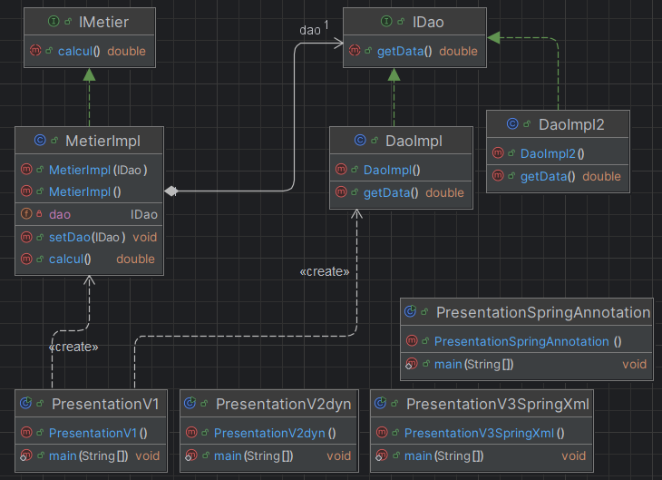

---


## ⚙️ Fonctionnalités

### 🧱 DAO Layer – Source de données simulée

- **IDao.java** : Interface déclarant la méthode `getData()`


- **DaoImpl.java** : Renvoie une valeur simulée (ex : 50)
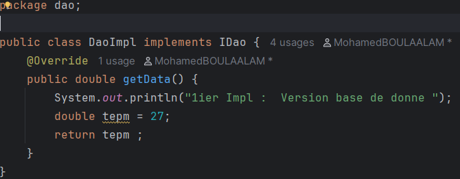

- **DaoImplV2.java** : Autre source simulée, alternative à DaoImpl
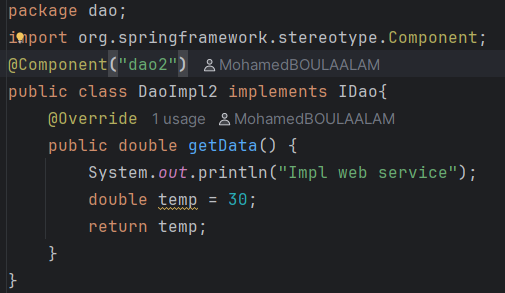

---


### 🧠 Métier – Couche de calcul

- **IMetier.java** : Interface avec la méthode `calcul()`
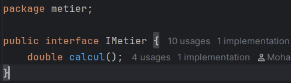

- **MetierImpl.java** : Implémente la logique métier avec injection de `IDao`
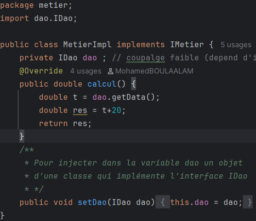

---


## 🔌 Injection des Dépendances 

### 🔹 a) Instanciation Statique – `PresentationV1.java`
Dans cette version, les objets `DaoImpl` et `MetierImpl` sont instanciés manuellement avec `new`.  
Le DAO est injecté via un setter (`metier.setDao(...)`).

📄 **Code :**

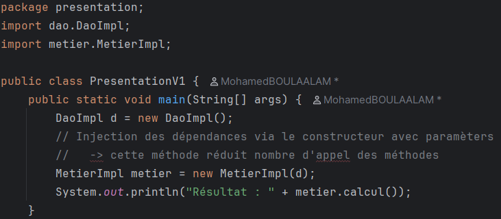

📊 **Résultat dans la console :**
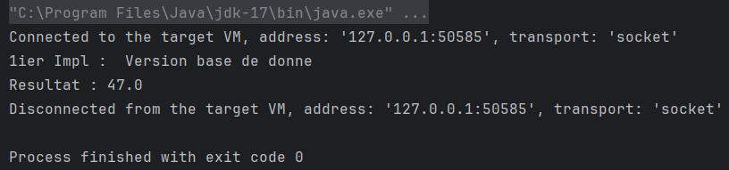

✅ **Avantages :**
- Simple à comprendre et mettre en place

❌ **Inconvénients :**
- Fort couplage entre les classes
- Pas flexible ni extensible

---

### 🔹 b) Instanciation Dynamique – `PresentationV2dyn.java`
Cette méthode utilise la **réflexion** en Java pour instancier dynamiquement les classes via `Class.forName(...)`.  
Les noms des classes peuvent être chargés depuis un fichier de config ou définis dynamiquement.

📄 **Code :**
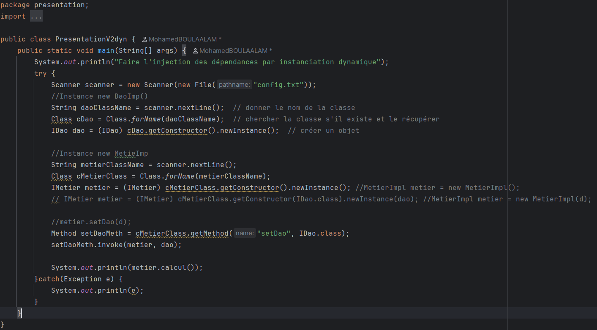

📊 **Résultat dans la console :**
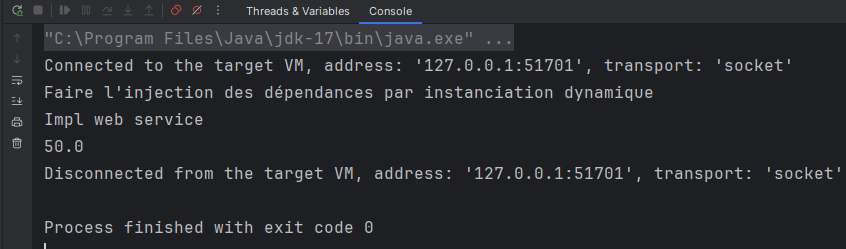


✅ **Avantages :**
- Faible couplage
- Classes remplaçables sans modification du code source

❌ **Inconvénients :**
- Moins lisible
- Débogage plus difficile

---

### 🔹 c) Injection avec Spring Framework

#### 📘 Version XML – `PresentationV3SpringXml.java` + `config.xml`
Spring gère les dépendances via un fichier de configuration XML.  
Les beans sont définis dans `resources/config.xml`.

📄 **Fichier XML :**
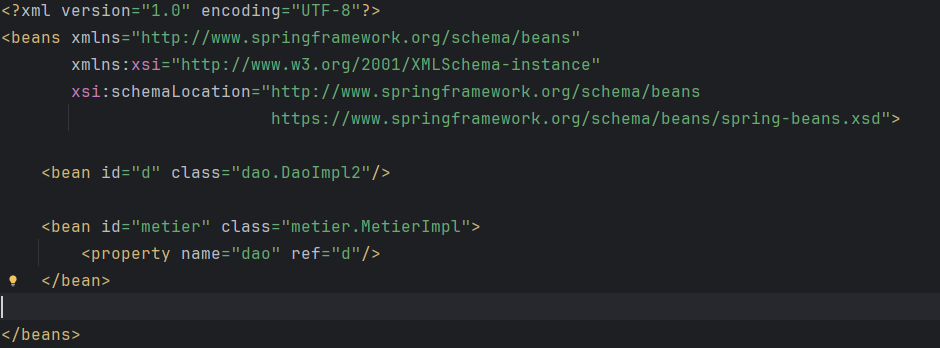

📄 **Code Java :**
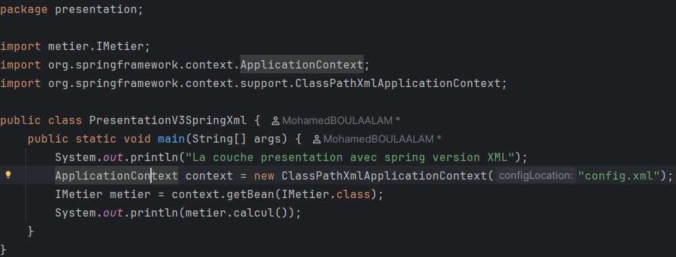

📊 **Résultat :**
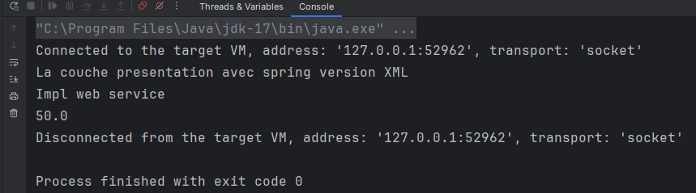

✅ **Avantages :**
- Centralisation des configurations
- Découplage total entre les composants
- Contrôle total via XML

---

#### 🏷️ Version Annotations – `PresentationSpringAnnotation.java`
Spring détecte automatiquement les dépendances via les annotations `@Component`, `@Autowired`, etc.

📄 **Code Java :**
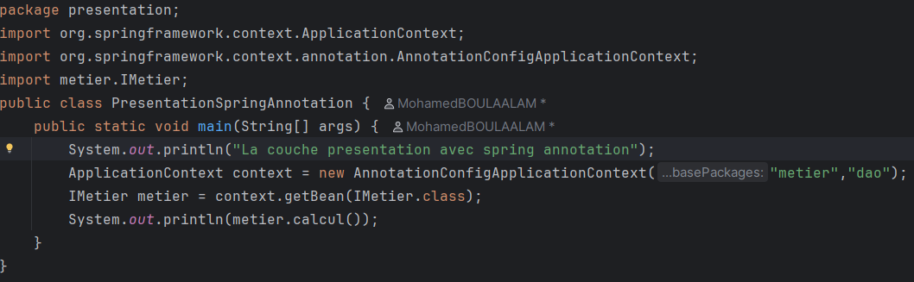

📊 **Résultat :**
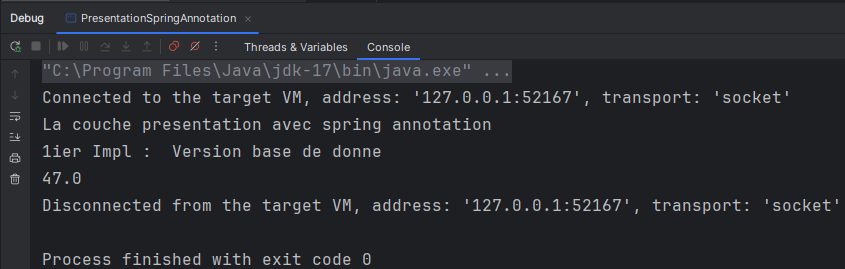

✅ **Avantages :**
- Moins de configuration XML
- Injection plus déclarative et moderne

❌ **Inconvénients :**
- Moins explicite pour les débutants

---

## 🗂️ Architecture du Projet
```
InversionControle_InjectionDependances/
│
├── Screens/                    ← 📸 Captures illustratives de chaque partie
│   ├── dao.png, metier.png, presv1.png, presxml.png, ...
│
├── src/main/java/
│   ├── dao/                   ← Couche d’accès aux données
│   │   ├── IDao.java
│   │   ├── DaoImpl.java
│   │   └── DaoImpl2.java
│   │
│   ├── metier/                ← Couche métier (calcul)
│   │   ├── IMetier.java
│   │   └── MetierImpl.java
│   │
│   └── presentation/          ← Points d’entrée selon les techniques
│       ├── PresentationV1.java
│       ├── PresentationV2dyn.java
│       ├── PresentationV3SpringXml.java
│       └── PresentationSpringAnnotation.java
│
├── src/resources/config.xml   ← Configuration Spring XML
├── pom.xml
└── README.md                  ← Rapport du projet
```

---


## 👨‍🎓 Auteur
**Mohamed BOULAALAM**  
Étudiant en ingénierie informatique, Big Data and Cloud Computing – ENSET Mohammedia